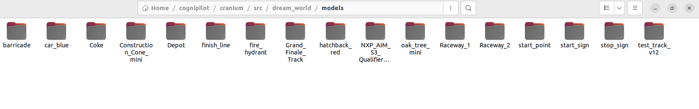
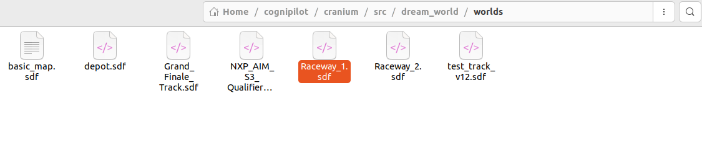
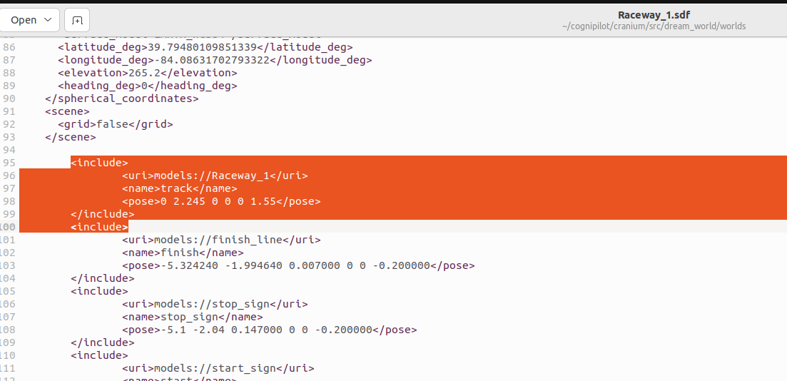

# Adding Obstacles in Simulation World

## Get all models to be used in Regional Finale
Below zip file contains all the gazebo models to be used in Regional Finale:


Gazebo obstacles (updated)


Please make sure you have latest obstacles, which are uploaded on 17th July,2024 (2 PM IST) 

Download and extract the obstacles in the following folder: _**~/cognipilot/cranium/src/dream_world/models**_

After extraction your folder should look like this:



## Adding Obstacles in Simulation World

To add obstacles to appear at start of simulation, you need to add model information to be included in the world file. To do this navigate to folder:  _**~/cognipilot/cranium/src/dream_world/worlds**_
And open the _**Raceway_1.sdf**_ file to include the information of various obstacles to be included in the simulation world at the start.



After the last _</scene>_ tag at the end of world file, we will add the information related to the models/obstacles to be spawned at the start. Refer to below image for more information:

Only models that are present in __**~/cognipilot/cranium/src/dream_world/models**_ directory can be included into the simulation by this method. 



#### Explanation of code:

```
<include>
  <uri>models://Raceway_1</uri>
  <name>track</name>
  <pose>0 2.245 0 0 0 1.55</pose>
</include>
```

* **"include":** This tag will contain information about one unique instance of any model spawned in simulation. Make sure to always have end tag as well, when using this (_"include"_).
* **"uri":** This tag will contain name/type of the model to be spawned into the simulation. This represents the name of the desired model that has to be spawned and is stored either in _**~/cognipilot/cranium/src/dream_world/models***_ .


Please make sure the name of the model passed to the _"URI tag"_ parameter must be case sensitive as well as present in the mentioned folder.


* **"name":** It is a custom unique identifier given to each entity which allows Gazebo to keep track of each model spawned into the simulation.


Use unique string values for the _"name"_ parameter for each obstacle to be added. As same value will not spawn the obstacles into simulation


* **"pose":** This parameter defines the position and orientation of models in simulation. rIt is represented by "x y z R P Y" where: **x is x-coordinate, y is y-coordinate, z is z-coordinate, R is roll, P is pitch and Y is yaw.**

Please make sure to run all the update commands mentioned to re-build the stack, in order to see the changes in next simulation run. 
