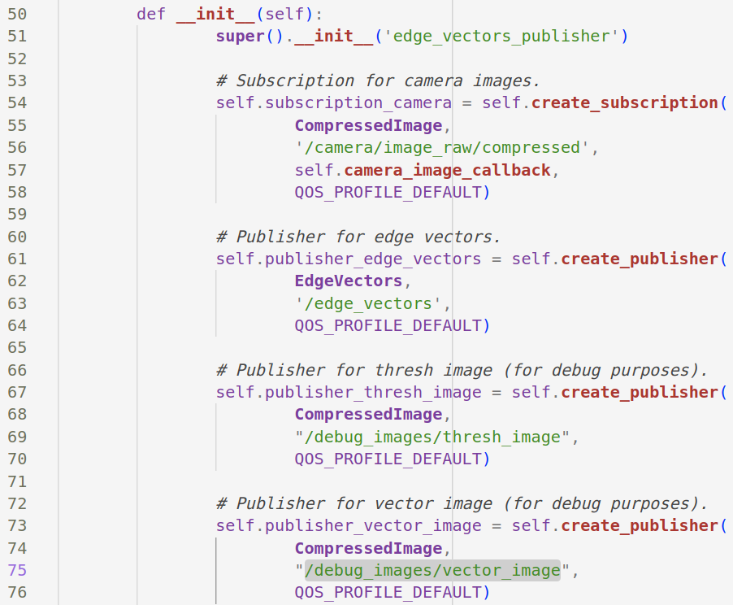

# Debugging with Foxglove
This tutorial describes how to perform debugging using Foxglove.

## FOXGLOVE INSTALLATION
After you have completed the initial setup for CogniPilot on a native ubuntu machine, open a new terminal and run "build_foxglove" to install foxglove on your machines.
- Note: If this command is not found, restart your system and try again.
- Select "y" when asked for clone repositories using git with already setup github ssh keys.
- Select "1" when asked for which release to be used - airy (1) or main (2).

## FOXGLOVE DEBUGGING

### PREREQUISITES
1. Camera Images: We can publish debug images from "b3rb_ros_line_follower/b3rb_ros_line_follower/b3rb_ros_edge_vectors.py". For publishing debug images from other ROS2 nodes, follow similar process.
    - Create a new publisher in the __init__ function as shown in the attached image. We need to create a new topic and in our case we have chosen "/debug_images/vector_image".
    - 
    - Now, pass this publisher (self.publisher_vector_image) and the image as arguments to the "publish_debug_image" function whenever you want to output your debug images.
    - Open a new terminal and run the following commands.
    	- cd ~/cognipilot/cranium
    	- colcon build
    	- source install/setup.bash
    - Add the same topic name "/debug_images/vector_image" to the default_value of topic_whitelist in electrode/src/electrode/launch/electrode.launch.py as shown in the attached image.
    - 
    - Open a new terminal and run the following commands.
    	- cd ~/cognipilot/electrode
    	- colcon build
    	- source install/setup.bash
2. LIDAR Data:
    - Add "/scan" to the default_value of topic_whitelist in electrode/src/electrode/launch/electrode.launch.py as shown in the attached image.
    - 
    - Open a new terminal and run the following commands.
    	- cd ~/cognipilot/electrode
    	- colcon build
    	- source install/setup.bash

### USING FOXGLOVE
- Open a new terminal and run the following command after starting the simulation (which is done using the command "ros2 launch b3rb_gz_bringup sil.launch.py world:=<track_name>")
    - ros2 launch electrode electrode.launch.py sim:=True
    - Then open connection to the url "ws://localhost:8765"
- Camera Images.
    - Create a new Image panel as shown in the attached image.
    - 
    - Then click on panel settings and select the topic for which you created a publisher in the "prerequisites" section.
    - 
    - Now this panel will display the image whenever you publish a debug image from your code to the said topic.
- LIDAR Data.
    - Create a new 3D panel by clicking on the add panel button from the top-left corner as shown in the attached image.
    - 
    - 
    - You may switch to 2D camera since the LIDAR is 2D.
    - 
    - Then click on panel settings.
    - 
    - Toggle visibility of "/scan" under Topics.
    - 
    - Then select "lidar_link" in Display frame under Frame.
    - 
        - If you don't immediately see the "lidar_link" option available, then close the settings panel, play the simulation for a few seconds, then try again.
    - You may close the panel settings after this.
    - Please see the attached images for sample output.
    - 
    - 
    - 
    - 
