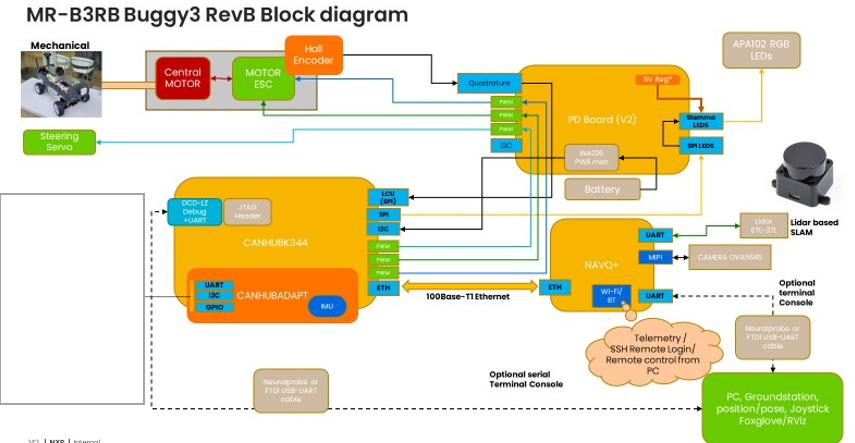
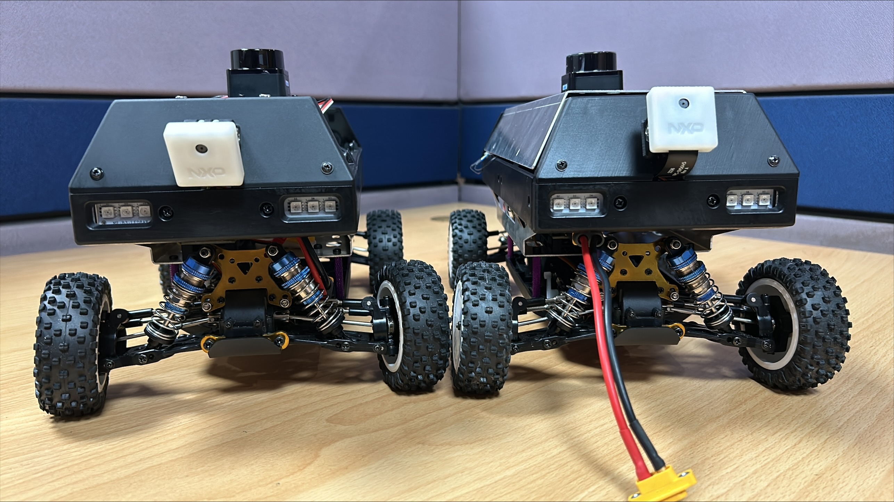
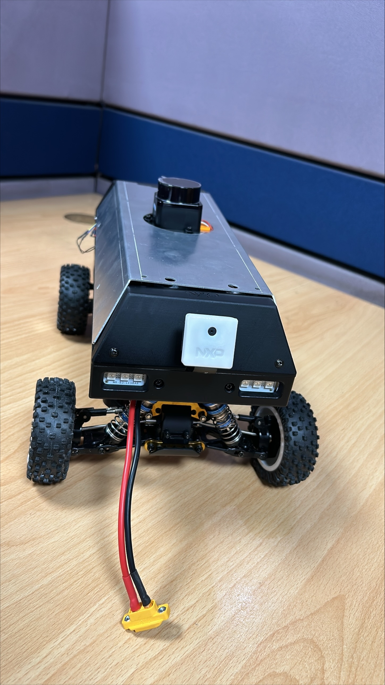
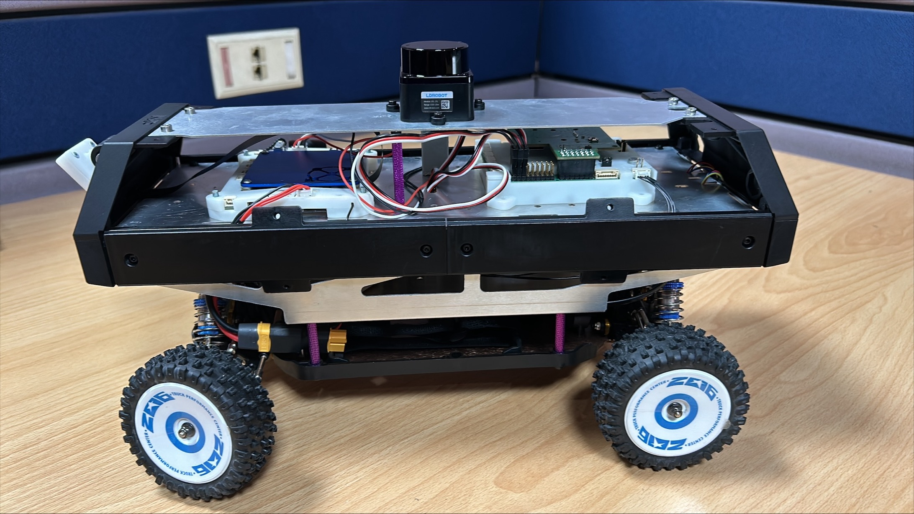
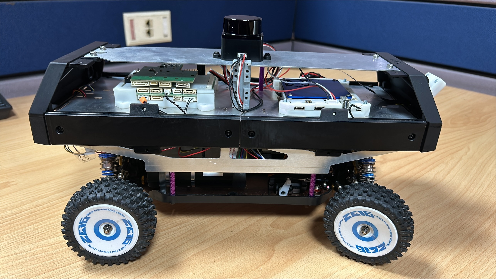
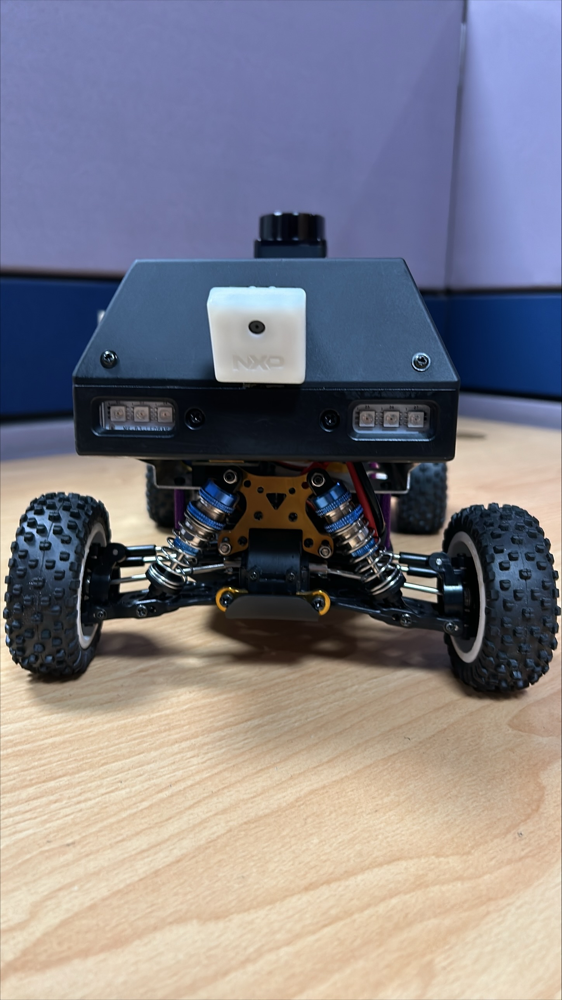
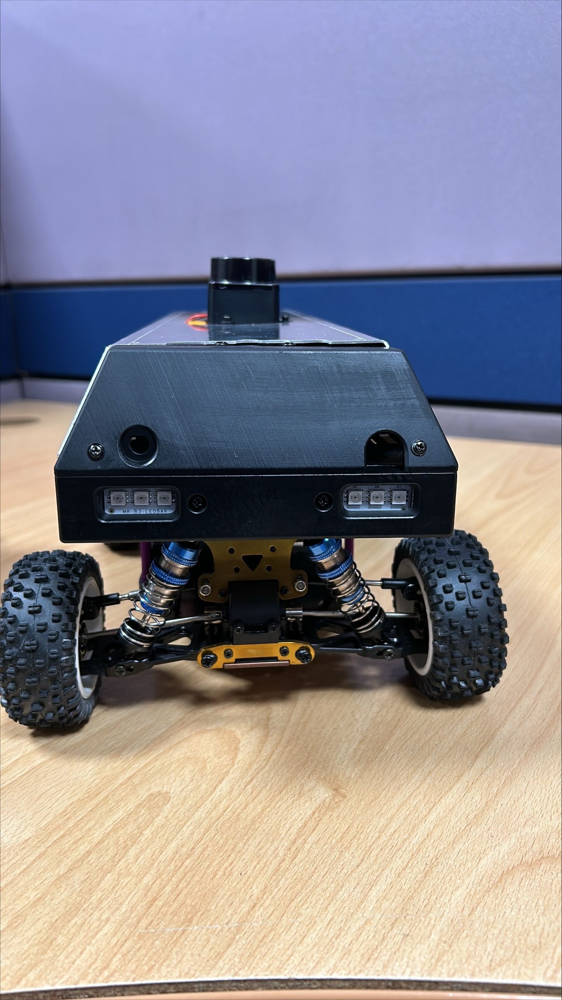

# NXP AIM HARDWARE BUGGY 

The NXP AIM Kit consists of following items:

    1. MR-B3RB-BMF
    2. NavQPlus incl. Camera
    3. MR-CANHUBK344
    4. MR-CANHUB-ADAP
    5. LIDAR
    6. MR-B3RB-MUK
    7. J-Link EDU MINI DEBUGGER
    8. Bonka 11.1V 2200mAh 25C 3S Lithium Polymer Battery Pack
    9. IMAX B3 AC Compact Balance Charger for 2S-3S LiPo
    
    
## Block Diagram

## List of Part List


Part Number: NXP AIM kit


## Dos And Don'ts of Buggy


NXP AIM kit: DOs and Don'ts


## Assembled NXP AIM Buggy Pics

