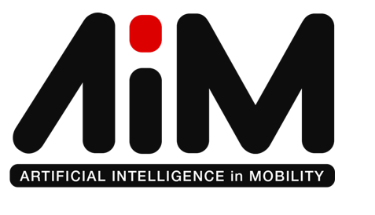

# Introduction to AIM Season 2024

## What is AIM 2024? 

AIM is a unique platform for the Engineering student community to raise awareness, create interest, and build enthusiasm in the field of Artificial Intelligence in Mobility and Robotics through project-based embedded system design challenges.

## Scope of Competition

This project will facilitate in development of algorithms for self-driving cars which will be later transferred on hardware of robot car. This  will involve:
1. Processing data taken as input from sensors attached on car
2. Taking in sensors’ output and move the car accordingly

Development of these algorithms and logic will be done by testing car model attached with sensors in several simulation worlds which have physics properties extremely close of real world. The simulation worlds used cover wide variety of real world test cases.

## AIM 2024 Challenge

The objective of the AIM 2024 is to design an autonomous car driving algorithm by interfacing the camera and lidar inputs to the car.

### Regional Finale Scope:
For the Regional Finale, in the Gazebo simulator, the participating teams need to complete the racetrack in the virtual environment  as fast as possible, using a camera as input along with obstacle detection and avoidance using Lidar.
