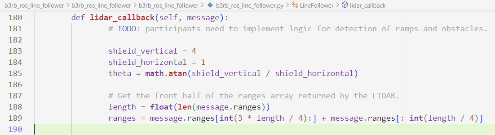
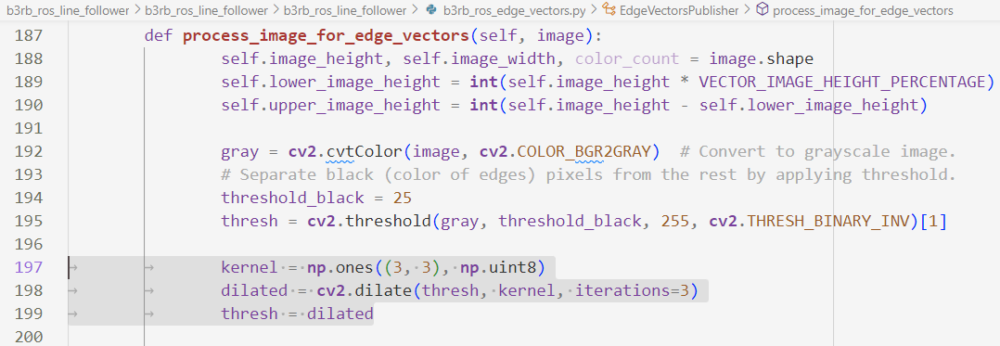
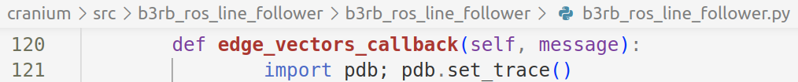
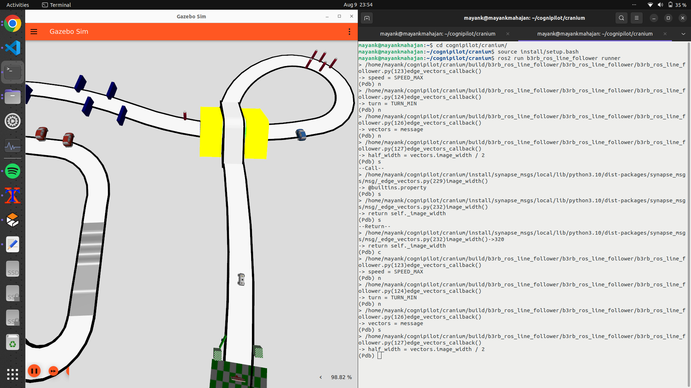

# Release Notes for Hardware Buggy

## SETTING UP HARDWARE B3RB

### SETTING UP NAVQPLUS

Follow - [https://airy.cognipilot.org/cranium/compute/navqplus/setup/](https://airy.cognipilot.org/cranium/compute/navqplus/setup/).

NOTE: Make sure you can connect NavQPlus to a Wi-Fi network; establish an alternative console via SSH over Wi-Fi.

### SETTING UP CANHUBK3

Follow - [https://nxp.gitbook.io/mr-b3rb/software/cognipilot-developer-guide-on-mr-b3rb/cognipilot-prepare-mr-canhubk344](https://nxp.gitbook.io/mr-b3rb/software/cognipilot-developer-guide-on-mr-b3rb/cognipilot-prepare-mr-canhubk344).

NOTE: Make sure to checkout "airy" branch at "~/cognipilot/ws/cerebri" before building and flashing Zephyr.

## HARDWARE DIFFERENCES
The following tutorial describes the changes that the participants will have to undergo when migrating from Gazebo Simulation to Hardware Buggy.

The following are the three ROS2 nodes that are impacted.

### 1. b3rb_ros_line_follower

#### LIDAR
The order of reporting of the obstacles by the hardware LIDAR STL-27L is different compared to the one in simulation. This is reflected in the "ranges" variable in the "lidar_callback" function. Hence, the code for retrieving the LIDAR data corresponding to the front hemisphere is different now. Please refer to the code below.
- 
- LIDAR STL-27L returns "nan" when no object is found within 25 meters.

### 2. b3rb_ros_edge_vectors

#### CAMERA
The images captured by Camera OV5645 may contain noise or glitches (unlike simulation camera which gives perfect images).
- Participants may need to apply image processing techniques to refine their captured image to be able to detect the edge vectors cleanly. As an example we have applied dilation while preprocessing the image for edge vectors in the function "process_image_for_edge_vectors".
- 

### 3. b3rb_ros_object_recog

#### YOLOv5
The YOLOv5 object recognition model is added in the Hardware Release in b3rb_ros_object_recog.py.
- It provides framework for running YOLOv5 TFLITE on NXP IMX8MPLUS NPU.
- The file b3rb_ros_object_recog.py provides reference for running Machine Learning models on NXP hardware.
- This model recognizes objects and draws a rectangle around them to identify their position.
- For the list of objects recognized by the YOLOv5 model, refer b3rb_ros_line_follower/resource/coco.yaml.
- By default, we have provided an untrained model that only recognizes the objects in coco.yaml.
  - Participants may be required to further train the default model to recognize more objects.
- Please feel free to modify the parameters for running YOLOv5 model for optimizing performance of object recognition.
  - There is no restriction to use YOLOv5; participants may choose a different model altogether as well.

### PHYSICAL CHARACTERISTICS
- Camera mounting angle significantly affects edge vector creation and object recognition. Participants could experiment with different angles to improve the overall performance.
- Buggy speed and steer should be set within the range [-1, +1] as mentioned in the docstring of the function "rover_move_manual_mode" in the node "b3rb_ros_line_follower".
  - It is advised that initial testing should be done with low speed such as 0.25 (to avoid any physical harm to the buggy), then gradually speed should be increased to improve time taken to complete the lap.

## <span style="background-color: #FFFF00">EXECUTION STEPS</span>

**NOTE: ALL STEPS IN THE FOLLOWING SECTIONS ARE SUPPOSED TO BE RUN ON NAVQPLUS.**

```
git clone git@github.com:NXPHoverGames/NXP_AIM_INDIA_2024.git
cd NXP_AIM_INDIA_2024
git checkout grand_finale
```
Move "b3rb_ros_line_follower" to "~/cognipilot/cranium/src/".

Open a terminal and follow the following steps to setup **Cranium**.
```
cd ~/cognipilot/cranium/src/
rm -rf synapse_msgs

git clone git@github.com:NXPHoverGames/synapse_msgs.git

cd ~/cognipilot/cranium/src/synapse_msgs
git checkout b3rb_ros_line_follower
```

Open a terminal on NAVQ+  and follow the following steps for building **Cranium** and running **b3rb_bringup**.
```
cd ~/cognipilot/cranium/
colcon build
source ~/cognipilot/cranium/install/setup.bash
ros2 launch b3rb_bringup robot.launch.py
```

Open a terminal on NAVQ+ and follow the following steps for running **b3rb_ros_edge_vectors**.
```
source ~/cognipilot/cranium/install/setup.bash
ros2 run b3rb_ros_line_follower vectors
```

Open a terminal on NAVQ+ and follow the following steps for running **b3rb_ros_object_recog**.
```
source ~/cognipilot/cranium/install/setup.bash
ros2 run b3rb_ros_line_follower detect
```

Open a terminal on NAVQ+ and follow the following steps for running **b3rb_ros_line_follower**.
```
source ~/cognipilot/cranium/install/setup.bash
ros2 run b3rb_ros_line_follower runner
```

## <span style="background-color: #FFFF00">TROUBLESHOOTING</span>

- While running YOLOv5, the NPU requires 15-20 seconds to warmup. Hence, wait sometime before logs appear.

## <span style="background-color: #FFFF00">DEBUGGING WITH PDB</span>

### COMMANDS
- n(ext): Executes the next line of code.
- s(tep): Steps into a function.
- c(ontinue): Continues execution until the next breakpoint.
- r(eturn): Continues execution until the current function returns.
- p(rint) expression: Prints the value of an expression.
- q(uit): Quits the debugger.

### DEBUG STEPS
1. Insert "import pdb; pdb.set_trace()" in the function where you want to debug.
- As an example, we have shown how to debug the "edge_vectors_callback" function.
- 
2. When the execution halts, type commands on the shell to perform debugging.
- For example, 'n' executes the next line; 's' steps into a function etc.
- 
