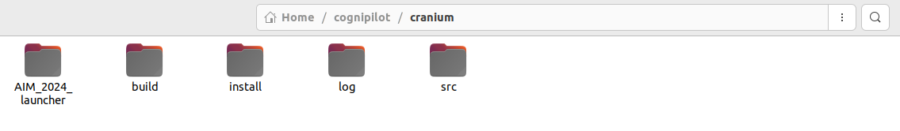
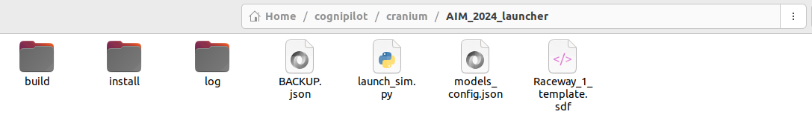
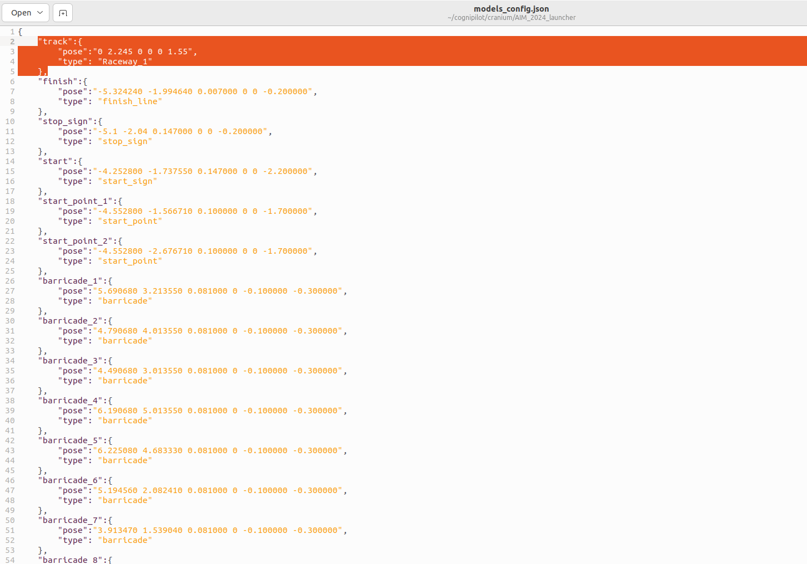

# Automation setup for Launcing Simulation

## Download the automation setup

Download the following package:


sample obstacles


Extract this package at location: _**~/cognipilot/cranium/**_. After extraction your directories should look like the following:





## What does this launcher does?

This launcher will take care of the following steps to execute the AIM 2024 simulation setup:
  - Preparation for clean build: deleting previous build's log, build and install folders
  - Clean Build: colcon build
  - Sourcing the setup.bash: source ~/cognipilot/cranium/install/setup.bash
  - Updating the Raceway_1.sdf world file to include the obstacles, before the build
  - Launching the simulation: ros2 launch b3rb_gz_bringup sil.launch.py world:=Raceway_1
  - Auto firing of command: ros2 run b3rb_ros_line_follower vectors
  - Auto firing of command: ros2 run b3rb_ros_line_follower detect
  - Auto firing of command: ros2 run b3rb_ros_line_follower runner

This launcher will do all the pre-requiste manual work to run the buggy in the simulation by default i.e. user doesn't need to manually run above said commands. 

The launcher will automatically always clean build the setup before execution, i.e. all changes will be automatically included. No need to separately run build/update commands. 

## Updating obstacles using the launcher in Raceway_1.sdf file

To add/remove the obstacle and track models in simulation, using this launcher one doesn't need to manually update the **Raceway_1.sdf** world file present at  _**~/cognipilot/cranium/src/dream_world/worlds**_.
To add obstacles using the launcher, one need to open and edit the _**models_config.json**_ file present inside the launcher directory (_**~/cognipilot/cranium/AIM_2024_launcher**_), in the following manner:



#### Explanation of code:


Please make sure to save the file before running the launch command and follow proper JSON syntax in the file


```
"embed_model_1": {
					"pose": "0.2 -0.45 0.09 0 0 0",
          "type": "start_point"
				}
```

* **"embed_model_1":** It is a custom unique identifier given to each entity which allows Gazebo to keep track of each model spawned into the simulation.


Use unique string values for the _"embed_model_1"_ key for each obstacle to be added. As same value will not spawn the obstacles into simulation


* **"pose":** This parameter defines the position and orientation of models in simulation. rIt is represented by "x y z R P Y" where: **x is x-coordinate, y is y-coordinate, z is z-coordinate, R is roll, P is pitch and Y is yaw.**
  
* **"type":** This tag will contain name/type of the model to be spawned into the simulation. This represents the name of the desired model that has to be spawned and is stored either in _**~/cognipilot/cranium/src/dream_world/models***_ .


Please make sure the name of the model passed to the _"type"_ parameter must be case sensitive as well as present in the mentioned folder.



Please make sure to save the file before running the launch command and follow proper JSON syntax in the file

