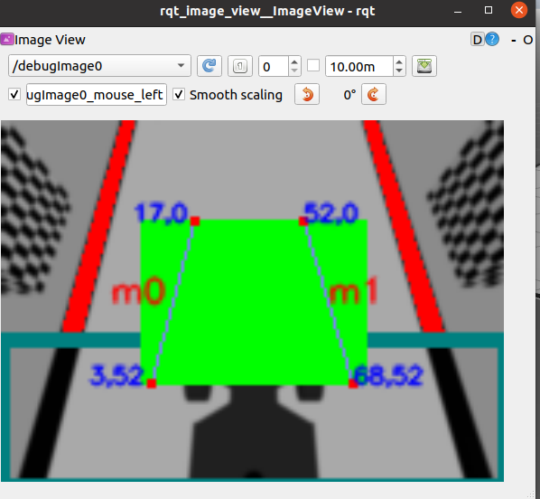

# Overview of the NXP Gazebo stack

## Summary

This page is designed to help contestants understand the inner-workings of the NXP Gazebo simulation stack. As a contestant, you will only need to focus on a small set of files within this massive workspace. In order to reduce confusion, we have created a detailed outline of all of the files and folders in the stack, and have documented the specific files and folders that contestants will be working with in order to write self-driving algorithms for their simulated NXP Cup car

## Outline of the stack

The NXP Gazebo simulation stack uses a diverse set of software to enable the simulation of the Cup car. Thankfully as NXP AIM India contestants, you will only need to use specific portions of the stack to develop your self-driving software. The stack is located in the `~/ros2ws/` folder and is set up as follows:

.png>)

| Folder      | Purpose                                                                                                                                              |
| ----------- | ---------------------------------------------------------------------------------------------------------------------------------------------------- |
| build       | ROS2 specific build folder.                                                                                                                          |
| install     | ROS2 specific install folder.                                                                                                                        |
| log         | ROS2 specific log folder.                                                                                                                            |
| nxp\_gazebo | Scripts and model files for simulation. Contains meshes and SDF files of car cup, camera and other necessary models to be used in simulation worlds  |
| osrf        | OSRF 3D model library for creating custom worlds                                                                                                     |
| src         | See the next section for an overview                                                                                                                 |

### src folder contents

The src folder within the ROS2 workspace contains specific ROS, Camera vision packages as well as the `sim_gazebo_bringup` package.

.png>)

| Folder                 | Purpose                                                                                                                            |
| ---------------------- | ---------------------------------------------------------------------------------------------------------------------------------- |
| aim\_line_\__follow    | Contains the sample code for self-driving car. This is the folder that participants are going to work on to design their algorithm |
| nxp\_cup_\__vision     | Contains the OpenCV vision code for simulating Pixy camera to detect lines                                                         |
| nxp\_cup_\__interfaces | Contains the PixyVector message for simulated Pixy Camera line detection algorithm                                                 |
| sim\_gazebo_\__bringup | Contains scripts for booting up the Gazebo simulation as well as setting up the simulation stack.                                  |

## Writing self-driving code

The participants are required to use aim\_line\_follow folder to write their logic and algorithm of the self-driving car. The content of the folder is shown below:

Inside the aim\_line\_follow sub-folder, a sample code for the self driving car has been provided inside _aim\_line\_follow.py_  file. Participants are required to edit this file in order to complete the challenge. Participants are allowed to use any resource and practices to achieve their desired results

A brief of the sample self-driving code will be discussed on the futher pages

## Viewing the simulated Pixy camera 

### Preface 

In order to provide a true-to-life simulated environment for NXP AIM India contestants, we have written a simulated Pixy camera module that detects lines and outputs vector data just like the real Pixy camera. The source code for the simulated Pixy camera uses OpenCV to fit vectors to detected lines in simulation.

### Guide

The simulation stack will open a new window that shows the debug output of the simulated Pixy camera. Here's what it looks like:


If you do not see the simulated Pixy camera output, use the drop down at the top left of the window and select /debugImage0.


The simulated Pixy camera detects the black lines in the environment and fits lines to them. Then, it will use those lines to create a simulated Pixy camera vector output in the Pixy camera frame space as seen below:

.png>)

As you can see in the simulated pixy camera output, the vector data returned is identical to the vector data that the real Pixy camera sends over I2C (vector head and tail coordinates for each vector). This allows contestants to use the same algorithms that are on their real NXP Cup cars.

The source code for this simulated Pixy camera is located at `~/ros2ws/src/nxp_cup_vision/nxp_cup_vision/nxp_track_vision.py` ​. You are free to edit this code if you see any potential areas of improvement!
